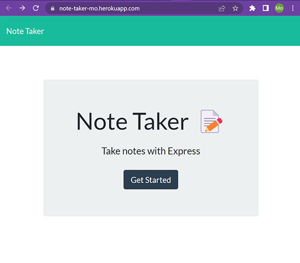
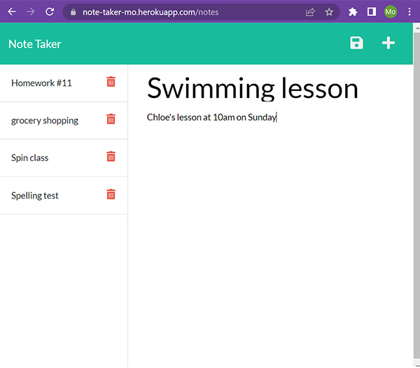

# note-taker

## Description
This web application is created to be used to write, save, and delete notes in order to organize and keep track of tasks I need to complete.

## Table of Contents

- [Usage](#usage)
- [Tests](#tests)
- [Credit](#credit)
- [Questions](#questions)

## Usage
Deployed page:  
https://note-taker-mo.herokuapp.com/

GitHub repository:  
https://github.com/morisky78/note-taker

As shown below, when you click on 'Get started' button, you will be directed to a notes page with existing notes in the left column and input field in the right column. `Save` and `New` icons are in the navigation at the top of the page.

### Enter a new note
Enter a new note title and text. When existing note is shown on the right column, click '+' button to write a new note. 
Click 'Save' icon, then the note will be saved and the title will appears with other existing notes. 

### See a note
Click on existing note title, then the entire note will show in the right column

### Delete a note
Click the `Delete` icon next to the note you want to delete.

## Credit
- Express
https://www.npmjs.com/package/express

- uniquid : to assign unique ID for each note
https://www.npmjs.com/package/uniqid

- How to Remove an Element from an Array by ID in JavaScript  
https://codingbeautydev.com/blog/javascript-remove-element-from-array-by-id/#:~:text=splice()%20Methods-,To%20remove%20an%20element%20from%20an%20array%20by%20ID%20in,the%20object%20from%20the%20array.

## Questions

If you have any questions, please contact me moran.risk78@gmail.com  
GitHub  profile: [morisky78](https://github.com/morisky78)

